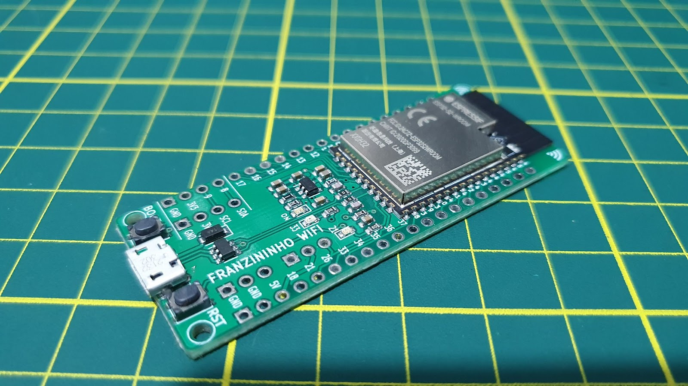
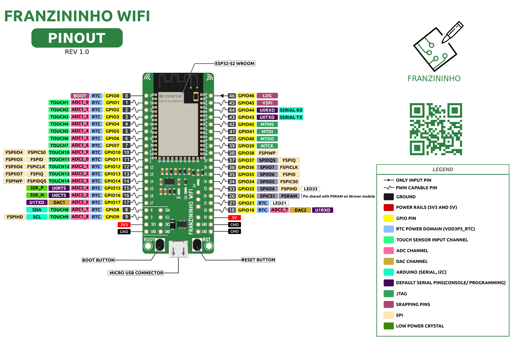

# Franzininho WiFi

The Franzininho WiFi Board is a development board based on the ESP32-S2-WROOM module.

---

## Features

- **ESP32-S2-WROOM Module**
  - Xtensa® single-core 32-bit LX7 microcontroller running at up to 240 MHz
  - Memory:
    - 128 KB ROM
    - 320 KB SRAM
    - 16 KB RTC SRAM
    - 4 MB Flash
  - Wi-Fi 802.11 b/g/n

- **Interfaces**
  - GPIO, SPI, LCD, UART, I2C, I2S
  - Camera, IR, pulse counter, LED PWM
  - TWAI (CAN), USB 1.1 OTG
  - ADC, DAC, touch sensor, internal temperature sensor

- **Pinout**
  - 40 pins arranged in 2x20 headers (2.54 mm pitch)
  - 35 GPIOs available
  - Breadboard compatible

- **LEDs**
  - 2 general-purpose LEDs

- **Buttons**
  - 1 × Reset
  - 1 × Boot

- **USB**
  - Micro USB connector (USB 1.1 OTG)

- **Power Supply**
  - 5V via USB connector
  - 5V and GND via pins
  - 3.3V and GND via pins

- **Programming Support**
  - ESP-IDF
  - Arduino
  - CircuitPython
  - MicroPython

---

## Pinout

## License

This project is open-source hardware and is available under the CERN Open Hardware License.
